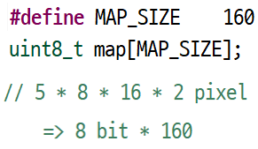
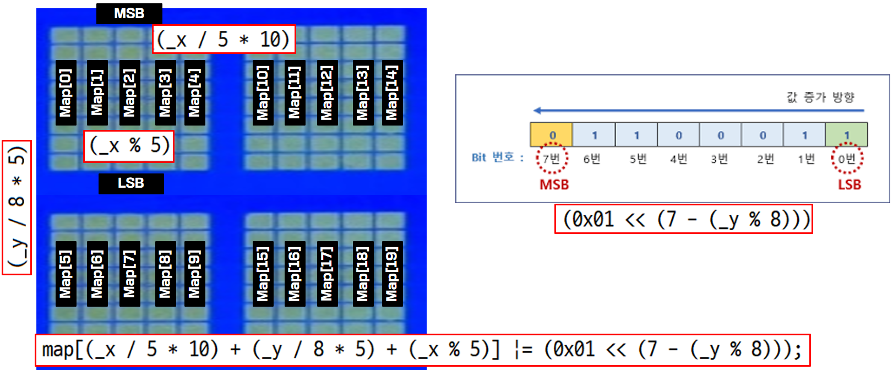
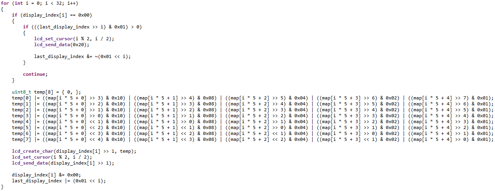
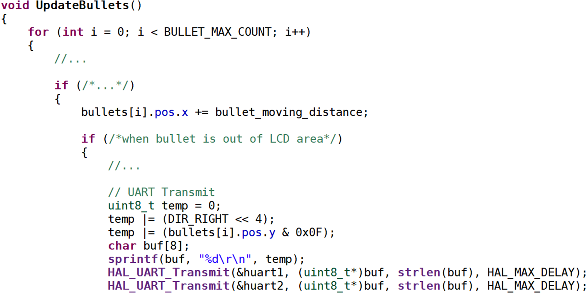
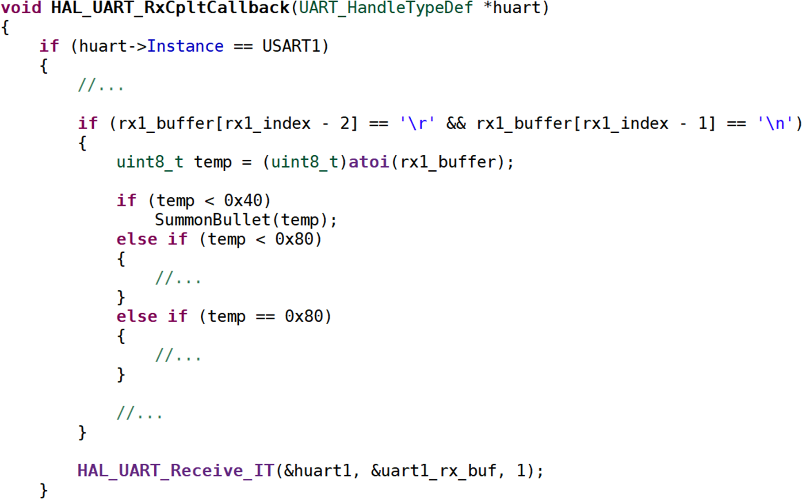
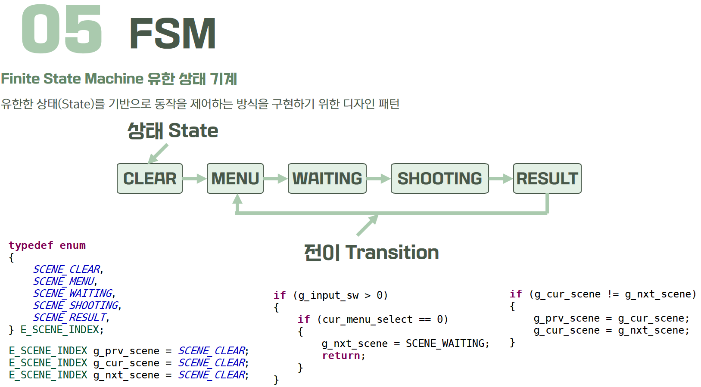
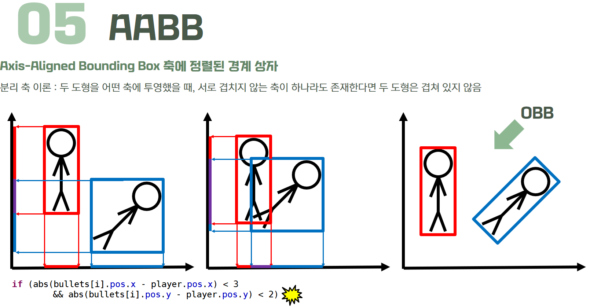

# LCD 극한 활용 게임

## 시연 영상 및 프로젝트 소개

  
LCD1602 모듈에서 일반적으로 **2행 x 16열 구조**에서 한 칸에 한 문자를 출력하는 것을 넘어  
**CGRAM을 활용**해 커스텀 문자를 출력하는 방식으로 **16행 x 80열 픽셀**을 활용해 게임을 구현합니다.  
이 때, CGRAM에는 **8개의 커스텀 문자**만 작성할 수 있다는 점을 고려해 최적화를 진행합니다.  
FSM을 이용해 각각의 상태에 맞는 로직을 수행합니다.  

- LCD1602 커스텀 라이브러리 구현
- UART 통신 활용 PvP 환경 구현
- FSM / AABB 활용

## 핵심 기술

- ### LCD1602 커스텀 라이브러리 구현

  - 80 (x) X 16 (y) 크기의 월드 좌표를 8 bit X 160 ea 크기의 배열에 변환 및 저장

  
  

  - 8 bit X 160 ea 크기의 배열에 저장된 값을 활용해 2 (row) X 16 (col) 공간에 그려질 커스텀 문자를 생성하고 출력

 

- ### UART 통신 활용 PvP 환경 구현

  - 총알 전송, 총알 충돌, 상대 대기 상태, 게임 종료 신호를 UART 로 송수신하여 각각의 동작을 수행

  
  

- ### FSM / AABB 활용

  
  

## 담당 업무
| 이름 | 담당 |
|------|------|
| **문두르** | 메인 프레임워크 / 게임 로직 구현 / LCD1602 픽셀 단위 제어 구현 |
| **강*구** | LCD1602 라이브러리 구현 / 조이스틱 / 부저 |
